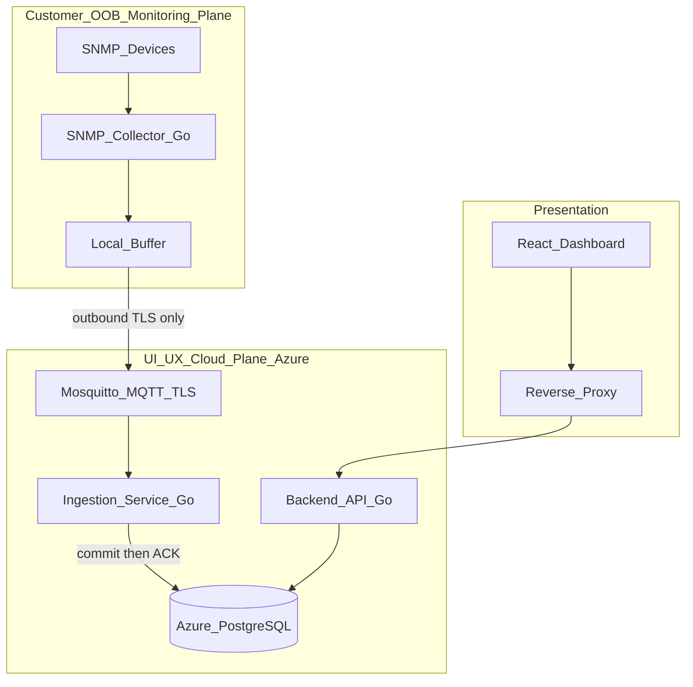
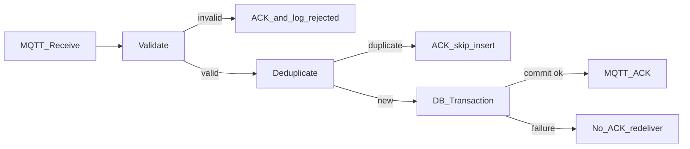
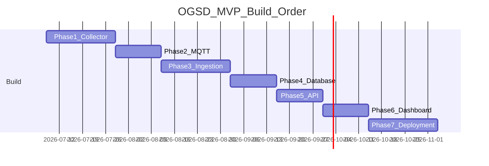

# Equate OGSD Implementation Plan

> MVP target: ~100–300 devices. Strict build order: Collector → MQTT → Ingestion → Database → API → Dashboard → Deployment.

---

## Table of Contents

1. [Architecture Status](#architecture-status)
2. [Required Changes](#required-changes-before-implementation)
3. [MVP Build Order](#mvp-build-order)
4. [Current Baseline](#current-baseline)
5. [Target Architecture](#target-architecture)
6. [Phase 1 — SNMP Collector](#phase-1--snmp-collector)
7. [Phase 2 — MQTT Transport](#phase-2--mqtt-transport)
8. [Phase 3 — Cloud Ingestion Pipeline](#phase-3--cloud-ingestion-pipeline)
9. [Phase 4 — Database Layer](#phase-4--database-layer)
10. [Phase 5 — Backend API](#phase-5--backend-api)
11. [Phase 6 — Frontend Dashboard](#phase-6--frontend-dashboard)
12. [Phase 7 — Production Deployment](#phase-7--production-deployment)
13. [Cross-Phase Timeline](#cross-phase-timeline)
14. [Key Risks and Mitigations](#key-risks-and-mitigations)
15. [Out of Scope](#out-of-scope-mvp)
16. [Ready to Implement](#ready-to-implement)

---

## Architecture Status

**Production-ready for MVP deployment (~100–300 devices). No major redesign required.**

The existing two-plane architecture, service boundaries, MQTT/TLS outbound-only model, PostgreSQL-as-system-of-record, and frontend dashboard are sufficient for initial rollout. Implementation work is **wiring and hardening** — not re-architecting.

### Strengths (preserve as-is)

| Area | Detail |
|------|--------|
| **Service boundaries** | Collector → polls, buffers, publishes · Ingestion → writes telemetry · API → read-only · Dashboard → API only |
| **Transport model** | MQTT/TLS outbound-only fits OOB customer requirements (no inbound cloud access) |
| **Frontend** | Existing [`frontend/`](../../frontend/) reduces Phase 6 to integration and auth, not a greenfield UI build |

---

## Required Changes (before implementation)

> These requirements are **mandatory for MVP** — not deferred enhancements.

### 1. Telemetry Reliability — Idempotent Ingestion

Ingestion must follow a strict pipeline. **Never ACK an MQTT message before database persistence succeeds.**

```
MQTT Receive → Validate → Deduplicate → DB Commit → ACK
```

#### Pipeline steps

| Step | Behavior |
|------|----------|
| **Validate** | Reject malformed JSON, bad timestamps, missing fields. Log `rejected`. ACK invalid messages (no retry) to prevent poison-queue blocking. |
| **Deduplicate** | Compute idempotency key per message type. Skip insert if key already exists. Treat duplicate as success. |
| **DB Commit** | Single transaction: auto-discovery upserts + sample insert + `last_seen` update. Roll back on any failure. |
| **ACK** | MQTT PUBACK only after transaction commits. On DB failure: do not ACK; message redelivered by broker (QoS 1). |

#### Idempotency keys

| Message type | Natural key |
|--------------|-------------|
| Device metric | `(device_id, metric_type_id, collected_at)` |
| Interface metric | `(interface_id, collected_at)` (canonical FK; `if_index` resolved via `interfaces`) |

Enforce via `UNIQUE` constraints on sample tables + `INSERT ... ON CONFLICT DO NOTHING` or equivalent existence check.

#### MQTT consumer settings

- QoS 1 subscription
- Manual acknowledgment mode (disable auto-ack)
- `Clean Session = false` for session recovery

---

### 2. SNMP Package Structure

Separate standard MIBs from vendor-specific OIDs:

```
services/snmp-collector/internal/snmp/
├── core/                  # Standard MIBs — MVP scope
│   ├── if_mib.go          # IF-MIB: interfaces, counters, errors
│   └── snmp_v2_mib.go     # SNMPv2-MIB: sysUpTime, sysDescr
└── vendors/
    └── {vendor}/          # Vendor OID maps added per vendor
        └── metrics.go     # e.g. vendors/cisco/, vendors/arista/
```

**MVP scope:** Implement `snmp/core` only (IF-MIB + SNMPv2-MIB). Vendor CPU/memory OIDs deferred to `snmp/vendors/{vendor}` — do not mix vendor OIDs into core packages.

Device config selects vendor package when present; falls back to core-only metrics.

---

### 3. Observability — Collector and Ingestion Metrics

Expose Prometheus-compatible `/metrics` endpoints (or structured log counters if Prometheus deferred to Phase 7).

#### Collector metrics

| Metric | Type | Description |
|--------|------|-------------|
| `collector_poll_total` | Counter | Poll attempts per device |
| `collector_poll_success_total` | Counter | Successful polls |
| `collector_poll_failure_total` | Counter | Failed polls (labeled by device, error class) |
| `collector_buffer_depth` | Gauge | Current buffered event count |
| `collector_buffer_enqueue_total` | Counter | Events written to buffer |
| `collector_buffer_flush_total` | Counter | Events flushed to MQTT |
| `collector_mqtt_connected` | Gauge | 1 = connected, 0 = disconnected |
| `collector_mqtt_publish_total` | Counter | MQTT publish attempts |
| `collector_mqtt_publish_failure_total` | Counter | Failed publishes |

#### Ingestion metrics

| Metric | Type | Description |
|--------|------|-------------|
| `ingestion_messages_received_total` | Counter | MQTT messages received |
| `ingestion_messages_accepted_total` | Counter | Validated + persisted |
| `ingestion_messages_rejected_total` | Counter | Validation failures |
| `ingestion_messages_deduplicated_total` | Counter | Duplicates skipped |
| `ingestion_db_write_failure_total` | Counter | Transaction rollbacks |
| `ingestion_processing_duration_seconds` | Histogram | End-to-end per message (receive → ACK) |
| `ingestion_mqtt_connected` | Gauge | 1 = connected, 0 = disconnected |

Phase 7 wires these into Azure Monitor alerting (buffer depth high, MQTT disconnected, DB write failures).

---

## MVP Build Order

Strict sequential implementation order:

| # | Phase |
|---|-------|
| 1 | Collector |
| 2 | MQTT |
| 3 | Ingestion |
| 4 | Database |
| 5 | API |
| 6 | Dashboard |
| 7 | Deployment |

**Note on Ingestion → Database ordering:** Ingestion service code (validate, deduplicate, store interface, ACK logic) is built in Phase 3. Phase 4 delivers production schema, dedup constraints, Azure PostgreSQL, and roles. Local Postgres with applied schema is required to pass Phase 3 exit criteria; Phase 4 completes production-grade database deployment.

---

## Current Baseline

| Area | Status |
|------|--------|
| Architecture docs ([`.ai/`](../), [`docs/architecture/`](../../docs/architecture/)) | Complete |
| PostgreSQL schemas ([`database/schema/`](../../database/schema/), [`database/migrations/`](../../database/migrations/)) | Defined (001–009 + golang-migrate; dedup constraints included) |
| Frontend dashboard ([`frontend/`](../../frontend/)) | Built — React 19, polling, demo fallback |
| Go services ([`services/`](../../services/)) | Collector + ingestion implemented; API scaffold |
| Infrastructure ([`infrastructure/`](../../infrastructure/), [`deployments/`](../../deployments/)) | Profiles: [`end-to-end/`](../../deployments/end-to-end/), [`development/`](../../deployments/development/), [`production/`](../../deployments/production/); Azure PostgreSQL Terraform (deferred for app stack) |

### Canonical decisions

| Decision | Choice |
|----------|--------|
| MQTT broker | Eclipse Mosquitto (self-hosted on Azure compute) |
| Telemetry contract | [`docs/architecture/contracts.md`](../../docs/architecture/contracts.md) |
| REST API prefix | `/api/...` (match [`frontend/src/services/sitesApi.js`](../../frontend/src/services/sitesApi.js)) |

**Doc reconciliation:** Update [`docs/architecture/ingestion-service.md`](../../docs/architecture/ingestion-service.md) to align with `contracts.md` and the idempotent ACK pipeline before Phase 3.

---

## Target Architecture



---

## Phase 1 — SNMP Collector

| | |
|---|---|
| **Goal** | Customer-side Go service polling devices via standard MIBs, normalizing to internal telemetry events |
| **Location** | [`services/snmp-collector/`](../../services/snmp-collector/) |

### 1.1 Project bootstrap

```
services/snmp-collector/
├── cmd/collector/main.go
├── internal/
│   ├── config/
│   ├── snmp/
│   │   ├── core/              # IF-MIB, SNMPv2-MIB (MVP)
│   │   └── vendors/{vendor}/  # Vendor OID maps (post-MVP per vendor)
│   ├── normalize/
│   ├── events/
│   ├── publisher/             # noop/stdout in Phase 1
│   └── metrics/               # Collector observability
```

Follow [`.ai/standards/golang-standards.md`](../standards/golang-standards.md).

### 1.2 SNMP polling scope (MVP — core only)

| Package | MIB | Metrics |
|---------|-----|---------|
| `snmp/core/snmp_v2_mib` | SNMPv2-MIB | `sysUpTime` → `uptime_seconds` |
| `snmp/core/if_mib` | IF-MIB | `ifIndex`, `ifHCInOctets`, `ifHCOutOctets`, `ifInErrors`, `ifOutErrors` |

Poll devices concurrently with bounded worker pool. Per-device failures increment `collector_poll_failure_total` without crashing the process.

### 1.3 Internal telemetry model

Per [`contracts.md`](../../docs/architecture/contracts.md):

- `DeviceMetricEvent` → topic `.../metric/device`
- `InterfaceMetricEvent` → topic `.../metric/interface`

### 1.4 Observability (Phase 1)

Implement collector metrics listed in [Required Changes §3](#3-observability--collector-and-ingestion-metrics). Expose `/metrics` endpoint on admin port (e.g. `:9090`).

### 1.5 Deliverables

- [ ] Collector polls devices using `snmp/core` packages
- [ ] Vendor package structure scaffolded (`vendors/` directory, no implementations yet)
- [ ] Normalized events via `Publisher` interface
- [ ] Collector metrics endpoint
- [ ] Unit tests for OID parsing and event shaping
- [ ] Container builds successfully

**Exit criteria:** Collector runs against `snmpsim`, emits structured events, metrics reflect poll success/failure.

---

## Phase 2 — MQTT Transport

| | |
|---|---|
| **Goal** | Resilient local buffering and secure outbound MQTT/TLS delivery |

### 2.1 Local buffer (`internal/buffer/`)

- SQLite storage, oldest-first flush
- Enqueue before publish; delete on broker ACK
- Configurable cap; expose `collector_buffer_depth` gauge
- Exponential backoff on disconnect

### 2.2 MQTT publisher (`internal/publisher/mqtt.go`)

| Event | Topic |
|-------|-------|
| `DeviceMetricEvent` | `site/{site_id}/device/{device_id}/metric/device` |
| `InterfaceMetricEvent` | `site/{site_id}/device/{device_id}/metric/interface` |

- TLS on port 8883, QoS 1, collector auth
- Track `collector_mqtt_connected`, publish success/failure counters

### 2.3 Mosquitto broker

[`infrastructure/docker/mqtt-broker/`](../../infrastructure/docker/mqtt-broker/): TLS, ACLs (collector publish-only, ingestion subscribe-only).

### 2.4 Deliverables

- [ ] Durable buffer with depth metrics
- [ ] MQTT/TLS publisher with connection status metrics
- [ ] Mosquitto Docker image for local dev
- [ ] Integration test: collector → Mosquitto
- [ ] Credential provisioning runbook

**Exit criteria:** Disconnect mid-flush, reconnect, all buffered messages arrive at Mosquitto.

---

## Phase 3 — Cloud Ingestion Pipeline

| | |
|---|---|
| **Goal** | Idempotent MQTT consumer with validate → deduplicate → commit → ACK pipeline |
| **Location** | [`services/ingestion-service/`](../../services/ingestion-service/) |

### 3.1 Service structure

```
services/ingestion-service/
├── cmd/ingestion/main.go
├── internal/
│   ├── config/
│   ├── mqtt/          # subscriber, manual ACK
│   ├── validate/
│   ├── dedup/         # idempotency key computation + check
│   ├── transform/
│   ├── store/         # transactional DB writes
│   ├── handler/       # orchestrates pipeline
│   └── metrics/
```

### 3.2 Ingestion pipeline (mandatory)



#### Rules

| Condition | Action |
|-----------|--------|
| Invalid messages | ACK immediately (prevent infinite redelivery of bad data) |
| Duplicates | ACK without insert (idempotent success) |
| New messages | ACK **only** after transaction commits |
| DB failures | No ACK; broker redelivers (dedup handles reprocessing) |

### 3.3 Auto-discovery (within transaction)

Site → device → interface upserts + sample insert + `devices.last_seen` update in a single transaction.

### 3.4 Observability (Phase 3)

Implement ingestion metrics listed in [Required Changes §3](#3-observability--collector-and-ingestion-metrics). Expose `/metrics` on admin port.

### 3.5 Deliverables

- [ ] Full validate → deduplicate → commit → ACK pipeline
- [ ] Manual MQTT acknowledgment (no auto-ack)
- [ ] Ingestion metrics endpoint
- [ ] Integration test with duplicate message delivery (verify no double-insert)
- [ ] Integration test with DB failure (verify no ACK, redelivery works)
- [ ] Dockerfile

**Exit criteria:** End-to-end collector → Mosquitto → ingestion → local Postgres with correct dedup and ACK behavior. Requires minimal local schema (apply `database/schema/` files for integration testing before Phase 4 production deployment).

---

## Phase 4 — Database Layer

| | |
|---|---|
| **Goal** | Production PostgreSQL deployment with dedup constraints, seeds, roles, and Azure provisioning |

### 4.1 Schema deployment

Apply existing files in [`database/schema/`](../../database/schema/) plus new dedup constraints:

```sql
-- 009_dedup_constraints.sql / migration 000002
ALTER TABLE metric_samples
  ADD CONSTRAINT uq_metric_sample_idempotency
  UNIQUE (device_id, metric_type_id, collected_at);

ALTER TABLE interface_samples
  ADD CONSTRAINT uq_interface_sample_idempotency
  UNIQUE (interface_id, collected_at);
```

### 4.2 Migration runner

`golang-migrate` or numbered scripts in [`database/migrations/`](../../database/migrations/).

### 4.3 Seed data

[`database/seed/`](../../database/seed/): `metric_types` for `uptime_seconds` and any core metrics.

### 4.4 Azure PostgreSQL

Terraform module in [`infrastructure/terraform/modules/`](../../infrastructure/terraform/modules/): Flexible Server, backups, private access, separate failure domain.

### 4.5 DB roles

| Role | Permissions |
|------|-------------|
| `ogsd_ingestion` | INSERT/UPDATE on inventory tables; INSERT+SELECT on sample tables (ON CONFLICT); SELECT on reference tables |
| `ogsd_api` | SELECT only |
| `ogsd_admin` | Migrations only |

### 4.6 Deliverables

- [x] Migration runner + all schemas including dedup constraints
- [x] Seed data
- [x] Azure PostgreSQL Terraform (dev + prod)
- [x] DB role scripts
- [x] Local Postgres Docker Compose service

**Exit criteria:** Ingestion and API connect with scoped credentials; dedup constraints enforce idempotency at DB level.

---

## Phase 5 — Backend API

| | |
|---|---|
| **Goal** | Read-only REST API exposing monitoring data matching frontend contracts |
| **Location** | [`services/backend-api/`](../../services/backend-api/) |

### 5.1 MVP endpoints

| Endpoint | Purpose |
|----------|---------|
| `GET /api/sites` | Overview with derived aggregates |
| `GET /api/sites/{siteId}` | Site detail + device summary |
| `GET /api/sites/{siteId}/devices` | Device list |
| `GET /api/devices/{deviceId}` | Device detail |
| `GET /api/devices/{deviceId}/interfaces` | Interfaces |
| `GET /api/devices/{deviceId}/metrics?start&end&metric` | Time-series |
| `GET /api/alerts` | Active alerts |
| `GET /api/test-config` | UI mode config |

### 5.2 Response shaping

Derive frontend fields (`avg_cpu`, `online_count`, site `status`, device status `1/2/3`) in API layer per [`monitoring-requirements.md`](../project-context/monitoring-requirements.md).

### 5.3 Deliverables

- [ ] All MVP read endpoints
- [ ] Aggregation queries tested against ingested data
- [ ] `ogsd_api` read-only DB connection
- [ ] Dockerfile

**Exit criteria:** API returns shapes compatible with [`useNetworkDashboard.js`](../../frontend/src/hooks/useNetworkDashboard.js).

---

## Phase 6 — Frontend Dashboard

| | |
|---|---|
| **Goal** | Live API integration, Google OIDC auth, production container |

Most UI exists in [`frontend/`](../../frontend/). Focus: wire remaining endpoints, auth, Dockerfile fix.

### 6.1 Integration

- Expand [`sitesApi.js`](../../frontend/src/services/sitesApi.js) for device detail, metrics, alerts
- Keep 5s polling and `live`/`demo` mode indicator

### 6.2 Authentication

Google OIDC: frontend sign-in → backend JWT validation → protect `/api/*`.

### 6.3 Deliverables

- [x] All views on live API (device/interfaces/metrics clients + adapters; honest empty charts for vendor metrics)
- [x] Google OIDC end-to-end (GIS sign-in + backend ID token validation)
- [x] Production frontend Dockerfile (Vite build + nginx)
- [x] Demo mode gated via `VITE_DEMO_ENABLED`

**Exit criteria:** Authenticated user browses sites → devices → interfaces with live data.


---

## Phase 7 — Production Deployment

| | |
|---|---|
| **Goal** | Containerized Azure deployment with TLS, monitoring, backups, operational hardening |

### 7.1 Local / client stacks

- [`deployments/end-to-end/`](../../deployments/end-to-end/): postgres, mosquitto, ingestion, backend-api, frontend, **and** SNMP collector in one Compose project
- [`deployments/development/`](../../deployments/development/): Mac cloud plane (no collector) + [`development/vxrail/`](../../deployments/development/vxrail/) collector on OrbStack/GNS3
- [`deployments/production/`](../../deployments/production/): hybrid Azure cloud + on-site VxRail skeleton

### 7.2 Azure topology

```
Azure Compute Host
├── Mosquitto (8883)
├── Ingestion Service
├── Backend API
├── Frontend + Reverse Proxy (HTTPS)

Separate: Azure PostgreSQL Flexible Server
```

### 7.3 Observability integration

- Wire collector + ingestion `/metrics` into Azure Monitor
- Alerts: buffer depth high, MQTT disconnected, DB write failures, ingestion latency p99
- Health endpoints (`/healthz`) on all services
- Structured JSON logs → Log Analytics

### 7.4 Deliverables

- [x] Docker Compose stacks (`end-to-end`, `development`, `production` skeleton)
- [ ] Terraform app/VM provisioning (Postgres Terraform exists; full stack deferred)
- [x] CI: build, test, cloud smoke (`.github/workflows/deployments.yml`)
- [ ] Reverse proxy (Caddy/NGINX) with TLS
- [ ] Runbooks: deploy, rollback, backup restore, collector onboarding
- [ ] Azure Monitor dashboards

**Exit criteria:** Production ingests live customer telemetry; authenticated dashboard over HTTPS.

---

## Cross-Phase Timeline



---

## Key Risks and Mitigations

| Risk | Mitigation |
|------|------------|
| MQTT redelivery storms on DB outage | Dedup constraints + no ACK until commit; monitor `ingestion_db_write_failure_total` |
| Buffer unbounded growth | Configurable cap + `collector_buffer_depth` alert |
| SNMP vendor variance | Core-only MVP; vendor OIDs isolated in `snmp/vendors/{vendor}` |
| Contract doc drift | `contracts.md` canonical; reconcile in same PR as implementation |
| Frontend aggregate fields | API derivation layer; indexes in `008_indexes.sql` |

---

## Out of Scope (MVP)

- Device configuration or console access
- Alert generation rules engine (schema exists; logic deferred)
- Azure API Management (deferred)
- Multi-tenant RBAC
- Vendor-specific OID implementations (structure only in Phase 1)
- TimescaleDB / partitioning

---

## Ready to Implement

Plan incorporates:

- Idempotent ingestion (`validate → deduplicate → commit → ACK`)
- SNMP core/vendor package separation
- Collector and ingestion observability

Proceed with Phase 1 implementation on confirmation.
