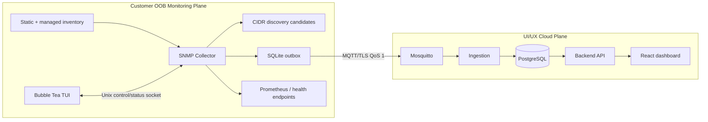

# snmp-collector-v2

> Status: agreed roadmap — July 2026
>
> Scope: SNMP Collector v2 and the required telemetry, ingestion, database, API, and dashboard work. The collector remains part of the Customer OOB Monitoring Plane and retains its outbound-only MQTT/TLS boundary.

---

## 1. Outcome

Deliver an operator-managed SNMPv2c collector that discovers and polls multiple devices concurrently, detects Cisco and Arista devices, emits structured telemetry reliably over MQTT, and presents an interactive local TUI. It must accurately distinguish a device that is down from one that is unreachable because an upstream dependency has failed.

The dashboard will expose live device and interface telemetry already represented in `frontend/src/`: uptime, CPU, memory, temperature, power-supply data, device identity, interface status, counters, errors, and traffic history.

## 2. Confirmed decisions

| Area | Decision |
|---|---|
| SNMP version | SNMPv2c only. Configuration validation rejects every other version. |
| Vendor support | Core SNMPv2-MIB and IF-MIB for all devices; auto-detected Cisco and Arista profiles add CPU, memory, temperature, and power telemetry. |
| Inventory | Read-only, user-managed YAML and a separate TUI-managed inventory file are both supported and merged. Device ID and IP uniqueness are validated across the merged result. |
| Discovery | Operator-invoked CIDR scan only, with user-configurable token-bucket probe rate and concurrency limits. It discovers candidates but never silently changes active inventory. Candidates may be explicitly exported to YAML or accepted into the managed inventory through the TUI. |
| Health | Healthy when reachable and below the temperature threshold; Warning when reachable and temperature is at/above its threshold; Critical when directly unreachable after the configured consecutive-failure threshold. CPU, memory, and power are collected/displayed but do not drive v2 health state. |
| Temperature policy | Default 65°C; TUI can set a global default and per-device overrides. The active policy is durable, versioned, and included as health-event evidence. |
| Failure threshold | Default two consecutive failed polls. A single failure is recorded as pending and does not immediately transition the device to Critical. |
| Reachability topology | Use dependency edges, not hub/spoke roles. Every device may have zero or more `upstream_device_ids` in v2. A device can be both upstream and downstream. |
| Cascade handling | Poll every device independently. After a complete cycle, a failed device is `Unknown (upstream unreachable)`, not Critical, only when all of its configured upstream paths are unavailable. |
| Configuration reload | Hot reload on `SIGHUP`, with a local TUI control action; parse, resolve references, validate, then atomically replace reloadable configuration. An invalid reload leaves the active configuration unchanged. |
| Transport | MQTT/TLS, QoS 1, durable SQLite outbox, and at-least-once delivery are retained. |
| Collector heartbeat | A periodic v2 heartbeat includes collector identity, build/runtime information, and SQLite queue depth. It is durably published through the same MQTT outbox and ingested as collector operational state. |

## 3. Current baseline and v2 boundary

The existing collector already has a bounded worker pool, static multi-device configuration, durable SQLite buffering, MQTT/TLS publishing, `/metrics`, `/healthz`, and startup configuration validation. v2 evolves those capabilities; it does not replace them.

The existing cloud path persists device/interface samples and derives a device as online from `status=online` plus `last_seen`. It has no health-event contract, no topology dependency graph, no vendor telemetry profiles, and no downstream representation for warning or upstream-unreachable state. Those are required v2 changes.

## 4. Target architecture



The TUI is local-only. It must not create an inbound customer-network management path or expose SNMP credentials through HTTP, logs, metrics, MQTT, or the cloud API.

## 5. Inventory, discovery, and reachability dependencies

### 5.1 Inventory sources

The primary config retains site, SNMP defaults, publisher settings, a required stable `collector.id`, configurable `collector.heartbeat_interval`, and a static device inventory for version-controlled deployment. It also names the managed inventory path. The collector loads both sources, applies explicit precedence rules, and validates the merged inventory before activation.

The managed file is the only file the TUI writes. Writes use a temporary file, restrictive permissions, fsync, atomic rename, and a subsequent reload. Secret values remain environment references; neither inventory source stores production community strings.

An illustrative device entry is:

```yaml
id: access-01
host: 10.0.20.11
community_env: SNMP_COMMUNITY_ACCESS_01
version: 2c
upstream_device_ids:
  - dist-01
  - dist-02
temperature_warning_c: 65 # optional per-device override
interface_filters:
  exclude_name_regex:
    - "^(Lo|Vlan|Null)"
```

`upstream_device_ids` reference stable device IDs, never IPs. The list may be empty, making a device a root for reachability correlation. It represents the immediate paths whose availability can affect the collector's ability to reach the device. Validation rejects duplicate entries, self-references, missing references, and cycles, producing an acyclic dependency DAG. Redundant upstream paths are an explicit v2 feature; the inventory is still not a claim to be a complete physical-network graph.

Descriptive fields such as `role`, `model`, or `location` may be retained as inventory metadata, but have no topology/health behavior. A device with an upstream and children is valid and expected.

### 5.2 CIDR discovery

Discovery is a `collector discover` CLI mode and a Bubble Tea TUI workflow, not an automatic poll-loop feature. It accepts only configured CIDR allowlists and applies configured target, timeout, retry, and concurrency limits. It also applies a user-configurable token bucket (`discovery.max_probes_per_second` and optional `discovery.probe_burst`) before every SNMP probe, so increasing worker concurrency cannot exceed the configured network probe rate. Validation requires a positive rate and a bounded positive burst; the TUI displays the active limit and allows an operator to change it through the managed inventory/configuration workflow. Each probe uses SNMPv2c to collect `sysObjectID`, `sysName`, and `sysDescr`; it does not require ICMP and it does not perform configuration actions.

Results contain the IP, fingerprint, detected profile, hostname/description, probe result, and timestamp. The operator may reject a candidate, export reviewed YAML, or explicitly accept it into the managed inventory. Acceptance requires a non-duplicate ID/IP and passes the same full validation as a normal reload. LLDP may later suggest dependency edges, but it must never activate or overwrite one without operator approval.

### 5.3 Topology-aware reachability

The collector still schedules every configured device and attempts every poll; it never suppresses a child poll merely because its dependency failed.

After each completed polling cycle, evaluate the dependency graph from roots to leaves:

1. A device with a successful poll is Healthy or Warning according to its temperature policy, regardless of an unsuccessful upstream poll. This reveals alternate paths or incorrect topology data.
2. A device that has not reached the consecutive-failure threshold retains its previous terminal state and records the pending failure count.
3. A failed root, or a failed device with at least one successfully polled configured upstream, becomes Critical once it reaches the threshold. A responding upstream is evidence that the collector's path was available, so the device failure is treated as direct.
4. A failed device becomes `Unknown` with reason `upstream_unreachable` only when every configured upstream is Critical or already `upstream_unreachable`. The event retains all unavailable upstream IDs and their root-cause IDs through the dependency DAG.
5. If no upstream succeeded and one or more upstreams are still below their own failure threshold, retain the prior terminal state and record correlation as pending; do not speculate that either the device or every path is down.
6. A successful later poll clears the reachability condition and failure count.

`Unknown` is an evidence state, not a claim that the dependent device is operational or failed. Site aggregation reports the root Critical device and its impacted-device count rather than inflating the critical count with every dependent device.

## 6. Polling, profiles, and interface selection

### 6.1 Concurrent polling

Retain the bounded worker pool and context-aware shutdown. Make per-device timeout, retry, interval, and concurrency overrides explicit and validate their bounds. Polling, normalization, publication, and health evaluation must have clear cancellation/ownership paths.

Each poll first collects the standard identity and IF-MIB data required for all profiles, then adds the detected profile's supported data. A profile failure must not discard successfully collected core data; it is recorded as a profile-collection failure instead.

### 6.2 Vendor profile contract

Profiles live under `internal/snmp/vendors/{cisco,arista}` and expose a small behavior-focused contract:

- fingerprint matching: `sysObjectID` is the only selection input; normalized `sysDescr` may be logged for unmatched-device diagnostics but never selects a profile;
- supported-capability declaration;
- OID collection and response validation;
- mapping into vendor-neutral readings with source/OID metadata available only to operator diagnostics.

The core profile is always available. Unknown or unsupported models fall back to core metrics without inventing zero values. Cisco and Arista profiles must support model-family-specific OID mappings for CPU utilization, memory utilization, temperature sensors, and power-supply components; profile fixtures are captured from approved lab devices/MIB documentation before a mapping is released.

Power and temperature are component readings, not a single fabricated scalar: their normalized model includes component name/index, value, unit, status, and source timestamp. Dashboard summary fields may select the documented primary temperature and summarize power health without losing the individual readings.

### 6.3 Interface filtering

Filtering occurs after interface inventory is read but before interface telemetry is emitted. Ordered rules support `ifIndex`, interface name/alias regular expressions, IF-MIB interface type, and admin/operational state.

The default excludes loopback, VLAN/SVI, and other virtual interfaces. Explicit includes can restore a default-excluded interface; a final explicit exclusion wins. Configuration validation compiles all regular expressions and rejects impossible ranges. The collector records selected/excluded counts and rule reasons without creating high-cardinality Prometheus labels.

## 7. Telemetry and storage contract

### 7.1 Versioned MQTT messages

Preserve v1 routes during migration and introduce explicit v2 routes:

```text
site/{site_id}/device/{device_id}/telemetry/v2/device
site/{site_id}/device/{device_id}/telemetry/v2/interface
site/{site_id}/device/{device_id}/telemetry/v2/health
site/{site_id}/collector/{collector_id}/telemetry/v2/heartbeat
```

Every v2 message includes a schema version, event ID, site/device/collector identity, observation timestamp, emission timestamp, and non-secret configuration revision. Route IDs and body IDs are cross-checked by ingestion. Event IDs plus the existing natural sample keys provide idempotent at-least-once ingestion.

The device message contains identity/fingerprint fields, profile/capability information, normalized scalar readings (`uptime_seconds`, `cpu_utilization_pct`, `memory_utilization_pct`, primary temperature), and component readings for temperature/power. The interface message contains interface identity/metadata plus counters, errors, speeds, and admin/oper status. The health message contains state (`healthy`, `warning`, `critical`, `unknown`), reason, failure count, threshold/policy revision when relevant, and upstream/root-cause evidence when relevant.

The collector publishes a heartbeat on a configurable interval (default 60 seconds) and on initial successful startup. Every heartbeat includes:

- `collector_id` — stable, configured collector identity;
- `hostname` — operating-system hostname at process start;
- `version`, `git_commit`, and `build_time` — build metadata injected at release build time, with an explicit `unknown` fallback for local development;
- `uptime_seconds` — process uptime at the heartbeat observation time;
- `sqlite_queue_depth` — durable outbox depth sampled before enqueueing the heartbeat itself;
- `memory_usage_bytes` — Go runtime allocated-heap snapshot; and
- `goroutine_count` — Go runtime goroutine snapshot.

The heartbeat follows the shared envelope and has its own `observed_at` timestamp/event ID. It contains no process arguments, paths, environment values, credentials, raw memory, or payload data. Delayed buffered heartbeats remain valid telemetry but ingestion updates current collector status only when the heartbeat observation time is newer than the stored value.

No message contains SNMP communities, TLS material, environment values, or raw secrets.

### 7.2 Ingestion and database

Add migrations and ingestion handlers before enabling v2 collection in production:

- seed metric types for CPU, memory, temperature, and supported power readings;
- persist richer device identity, profile/fingerprint, interface metadata, and component inventory/readings;
- persist current health state and history, including reason, observed time, failure count, threshold evidence, and upstream/root cause;
- persist current collector status and heartbeat history, including identity/build fields and runtime/outbox values, with observation-time ordering;
- preserve one transactional pipeline per message: validate → deduplicate → upsert inventory/state and samples → commit → MQTT acknowledge;
- reject unknown schema versions, unrecognized metric units, invalid state transitions, invalid IDs, stale/malformed timestamps, and body/topic mismatch;
- make device status history and metrics queryable without treating MQTT or collector-local state as authoritative.

The ingestion service owns persistence and API-facing monitoring state. The collector supplies evaluated local reachability evidence because it is the only component that observes the polling path and its managed dependency policy.

### 7.3 API and dashboard

Extend API contracts and the React adapters in lockstep. Preserve current numeric status compatibility (`1` healthy, `2` warning, `3` critical) and add `0` for unknown/upstream-unreachable alongside explicit `status_reason`, `upstream_device_ids`, `unavailable_upstream_device_ids`, and `root_cause_device_ids` fields.

Add live CPU, memory, and temperature history to the existing device charts; live temperature, power-supply components/status, vendor/model/serial, and SNMP identity to device details; and current interface metadata/counters/status plus traffic history to interface views. Site/device summaries must expose warning state, critical count, and dependency-impacted count distinctly. The frontend adds an Unknown visual treatment instead of presenting it as Critical.

## 8. Operations and administration

### 8.1 Bubble Tea TUI

`collector tui` is an interactive client of the running collector's local Unix status/control socket. It is not embedded in the daemon's normal output path and must remain usable without cloud connectivity.

Views and actions:

- inventory: validation state, last poll, health, and dependency path;
- discovery: allowed-CIDR scan progress, candidate review, export, and managed-inventory acceptance;
- transit: SQLite depth, MQTT connection, retry state, publish failures, and last successful flush;
- settings: active revision, temperature thresholds, reload results, and validation diagnostics.

Mutation commands require local OS access, use an explicit confirmation step, produce an audit entry without secrets, and cannot modify the static YAML source.

### 8.2 Validation and reload

Provide `collector validate -config …` for CI and operator use. It validates YAML shape, defaults, duration/range bounds, env-reference names (not their secret values), MQTT/TLS settings, source file permissions, inventory uniqueness, dependency graph, profile names, heartbeat interval, discovery target/rate/burst/concurrency limits, interface regexes, and temperature-policy bounds.

Reload is transactional: load both inventories, resolve references, apply defaults, validate, prepare replacement poll/profile state, then atomically expose the new snapshot. Existing polls complete against their captured snapshot; subsequent work uses the new one. Invalid reloads increment a metric, retain the prior snapshot, and are visible in the TUI/status endpoint. Publisher reconnection occurs only when publisher settings changed; the SQLite outbox persists across reloads.

`/metrics` remains scrape-only. `/healthz` is process liveness. `/readyz` confirms an active valid configuration, available buffer, and a usable publisher (connected MQTT when MQTT mode is selected); polling and buffering continue during MQTT outage. A localhost/Unix-socket status surface supplies detailed, authenticated operator information; it is never public.

### 8.3 Metrics and logs

Retain existing poll/buffer/MQTT metrics and add bounded-cardinality metrics for inventory size, active configuration revision, reload successes/failures, profile detections/fallbacks/collection failures, discovery attempts/candidates/errors/rate-limit waits, interface selections/exclusions, device health transitions, dependency-impacted devices, heartbeat publish outcomes, and readiness. Histograms cover poll, profile, discovery, publish, heartbeat, and reload duration.

Use structured logs with site/device identifiers, profile, state transition, reason, and error class. Redact SNMP communities, MQTT credentials, certificates, payload bodies, and any secret-derived data.

## 9. Delivery phases

### Phase 0 — Contract and migration design

- Document v2 routes/schemas, metric units, health states/reasons, idempotency, ordering, compatibility, and deprecation of v1 publishing.
- Define migrations, retention/indexing, API response examples, and React adapter contracts.
- Capture Cisco and Arista lab fixtures and confirm model-specific OID mappings before coding profiles.
- Exit: contract and database/API/collector migration sequence are reviewed; all producers/consumers have compatibility tests planned.

Phase 0 artifacts:

- [`collector-1.md`](../decisions/collector-1.md) — envelope, health taxonomy, transition model, ownership, migration, and test decisions.
- [`docs/schemas/snmp-collector-v2/`](../../docs/schemas/snmp-collector-v2/) — Draft 2020-12 event schemas and sanitized examples.
- [`docs/architecture/contracts.md`](../../docs/architecture/contracts.md) — transport contract, units, compatibility, and security rules.
- [`docs/architecture/snmp-vendor-mappings.md`](../../docs/architecture/snmp-vendor-mappings.md) — official evidence matrix and lab-fixture gate.

Official MIB documentation is sufficient for the Phase 0 mapping matrix. Sanitized Cisco and Arista lab fixtures remain a required gate before Phase 2 profile implementation; no live credentials or device-sensitive captures are committed.

### Phase 1 — Runtime configuration and inventory foundation

- Introduce merged static/managed inventories, `community_env` references, atomic managed writes, full validation CLI, and reload snapshots.
- Add per-device polling overrides, temperature policies, interface filters, and multi-upstream dependency-DAG validation.
- Preserve current collector behavior when v2 additions are absent.
- Exit: valid changes reload without restart; invalid changes leave active polling intact; inventory/dependency/filter validation has table-driven tests.

### Phase 2 — Polling, profiles, and discovery

- Refactor polling around a core identity/IF-MIB pass and capability-based profile enrichment.
- Implement Cisco and Arista fingerprinting plus CPU, memory, temperature, and power collection using tested model-family mappings.
- Implement operator-driven, allowlisted CIDR discovery with configured token-bucket rate limiting and candidate persistence/export.
- Exit: simulated and captured fixtures verify core fallback, detection, normalized readings, error isolation, filtering, concurrency bounds, rate limits, and discovery safety.

### Phase 3 — Health and reachability correlation

- Track poll outcomes/failure counts across cycles; evaluate temperature policy and the dependency graph only after a full cycle.
- Emit health transitions, including upstream/root-cause evidence and recovery.
- Add the specified health, dependency, and operational metrics/endpoints.
- Exit: scenario tests prove root failure, multi-level impact, alternate-path success, independent child failure, pending-failure behavior, recovery, and cycle/reload cancellation behavior.

### Phase 4 — MQTT v2 telemetry and cloud ingestion

- Add v2 device/interface/health/heartbeat event serialization, durable outbox support, MQTT routes, schema validation, and compatibility publishing/rollout controls.
- Apply migrations; implement transactional ingestion, idempotency, inventory/state/history persistence, and observability.
- Exit: integration tests prove no acknowledged data loss through broker/database interruption, duplicate redelivery, malformed/rejected messages, and mixed v1/v2 rollout.

### Phase 5 — API and dashboard

- Add device/site/interface/history endpoints/fields for v2 metrics, components, health reasons, and dependency impact.
- Update React data adapters, charts, device information, interface panels, and Unknown/status-summary treatments.
- Exit: API and frontend integration tests cover all confirmed dashboard fields and distinguish Critical root cause from Unknown impacted devices.

### Phase 6 — Bubble Tea TUI and production hardening

- Implement the local-only status/control protocol and the TUI views/actions.
- Add end-to-end tests with real MQTT/TLS, persisted TUI inventory, reload, discovery candidates, failure cascades, and dashboard rendering.
- Update deployment examples, least-privilege filesystem ownership, runbooks, and rollback/migration procedures.
- Exit: operator can install, validate, discover, review, configure thresholds/dependencies, reload, observe, and recover without a collector restart or cloud-side configuration access.

### Phase 7 — Deployment, operations, and final acceptance

- Update the three supported deployment profiles only (`end-to-end`, `development`, `production`); do not add phase-named stacks.
- Mount static inventory read-only; managed inventory, audit, and SQLite outbox on a least-privilege state volume; Unix control socket on a runtime mount outside public port mappings.
- Ship V2-only production telemetry (`publisher.telemetry_version: v2`); reconcile contract/roadmap dual-publish language via [`collector-7.md`](../decisions/collector-7.md).
- Point deployment ingestion at v2 MQTT topics; update smoke/acceptance tooling to validate v2 envelopes; keep migrations before collector enablement.
- Publish runbooks for install, inventory/discovery, credential/certificate rotation, queue remediation, rollback/restore, V2 cutover, and manual GNS3/VMware field acceptance.
- Exit: operators can deploy, validate, smoke-test v2 paths, and recover using documented procedures; full hardware field acceptance is a manual checklist.

Phase 7 artifact: [`collector-7.md`](../decisions/collector-7.md).

## 10. Acceptance criteria

- A single collector polls a configured multi-device inventory concurrently without exceeding its worker limit; one device failure does not block another.
- Only SNMPv2c is accepted; all SNMP/MQTT I/O is bounded by context and configured timeouts.
- Cisco and Arista fixtures emit normalized CPU, memory, temperature, and power readings; unsupported models produce core data and a visible profile fallback, never fabricated values.
- Discovery can only scan allowlisted CIDRs, cannot auto-enroll devices, and produces reviewable candidates.
- Discovery never exceeds its configured probe rate or burst, regardless of worker concurrency; the TUI exposes the active user-configured limit.
- A valid TUI-managed inventory update is atomically persisted/reloaded; invalid writes/configuration do not change active collection.
- A device exceeding its configured temperature threshold is Warning; temperature recovery returns it to Healthy when reachable.
- A directly unreachable device becomes Critical only after two configured consecutive failures. CPU, memory, and power do not change that state in v2.
- In a core → distribution → access chain, a failed root is Critical and failed descendants are Unknown with the root cause retained. Every descendant is still polled. A responding descendant stays Healthy/Warning.
- A failed device with redundant upstreams is Unknown only when every configured upstream path is unavailable; if one upstream responds, the failed device is Critical after its failure threshold.
- MQTT outage buffers telemetry durably and resumes ordered flush/retry on reconnection; ingestion acknowledges only after its transaction commits.
- Each initial-startup and periodic heartbeat carries `collector_id`, hostname, version, Git commit, build time, uptime, SQLite queue depth, memory usage, and goroutine count; delayed delivery cannot overwrite a newer collector-status observation.
- `/healthz`, `/readyz`, `/metrics`, logs, and the TUI accurately show liveness, readiness, configuration reload outcomes, polling, profiles, health, dependency impact, buffer depth, and MQTT state without leaking credentials.
- The API/dashboard render live data for every metric and state named in this roadmap, including an explicit Unknown presentation.

## 11. Deliberate non-goals for v2

- SNMPv3, write/configuration SNMP operations, and device console access.
- Automatic inventory enrollment or automatic activation of LLDP-derived dependencies.
- Automatic redundant-path inference or a full physical-network graph. Operators explicitly configure the upstream dependency DAG.
- Alert acknowledgement/workflow management, threshold rules for CPU/memory/power, and cloud-side editing of collector credentials.
- Replacing MQTT, SQLite buffering, PostgreSQL ownership, or the outbound-only customer-plane architecture.

## 12. Risks and controls

| Risk | Control |
|---|---|
| Incorrect dependency data masks a genuine child outage | Continue independent child polls; use `Unknown` only when the child and every configured upstream path fail; show dependency path/reason; require operator approval. |
| Vendor OIDs vary by model/OS | Fingerprint model families; fixture-test mappings; expose capability/fallback; do not emit guessed values. |
| Discovery is disruptive or overbroad | Allowlisted CIDRs, target caps, rate/concurrency bounds, short timeouts, explicit invocation, and no automatic enrollment. |
| Reload creates partial/inconsistent work | Immutable configuration snapshots, validate-before-swap, captured snapshot per poll, and durable outbox independent of runtime config. |
| Local TUI/control endpoint expands exposure | Unix socket/localhost only, OS access controls, explicit mutation confirmation, no public mutation HTTP endpoint, and secret redaction. |
| Schema rollout breaks existing services | Versioned routes, staged ingestion first, compatibility publishing, contract tests, and explicit cutover/rollback criteria. |
