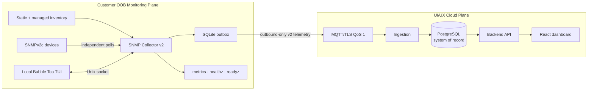

# System Design — SNMP Collector v2

This is the maintainable source diagram for the current architecture. Generated exports are derived artifacts.

The collector sends device, interface, health, and heartbeat telemetry. Dependency edges are local reachability evidence; they are not a complete physical-network graph. The TUI and status/control surface remain local-only.
