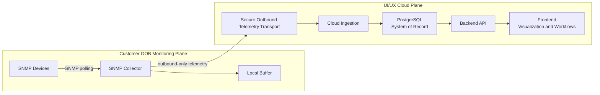

# System Design

This is the maintainable source diagram for the current architecture. Generated diagram exports must be treated as derived artifacts.

```mermaid
flowchart LR
    subgraph customer["Customer OOB Monitoring Plane"]
        devices["SNMP Devices"]
        collector["SNMP Collector"]
        buffer["Local Buffer"]
        devices -->|"SNMP polling"| collector
        collector --> buffer
    end

    subgraph cloud["UI/UX Cloud Plane"]
        transport["Secure Outbound Telemetry Transport"]
        ingestion["Cloud Ingestion"]
        postgres["PostgreSQL\nSystem of Record"]
        api["Backend API"]
        frontend["Frontend\nVisualization and Workflows"]
        transport --> ingestion
        ingestion --> postgres
        postgres --> api
        api --> frontend
    end

    collector -->|"outbound-only telemetry"| transport
```
